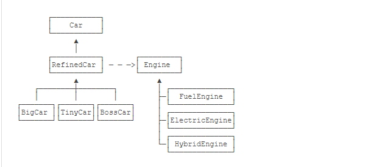

#### 面向对象
 - 面向对象设计原则概述
   - 面向对象设计原则之单一职责原则
   - 面向对象设计原则之开闭原则
   - 面向对象设计原则之里氏代换原则
   - 面向对象设计原则之依赖倒转原则
   - 面向对象设计原则之接口隔离原则
   - 面向对象设计原则之合成复用原则
   - 面向对象设计原则之迪米特法则
#### 设计模式
  ##### 对象创建型模式
   
  ##### 结构型模式
  
  ##### 行为型模式
  
  