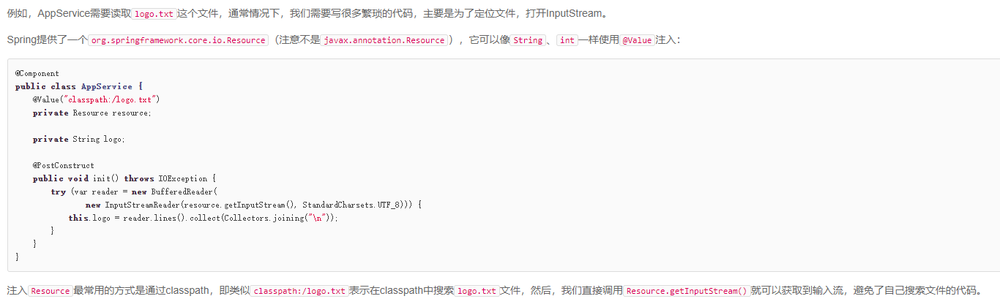
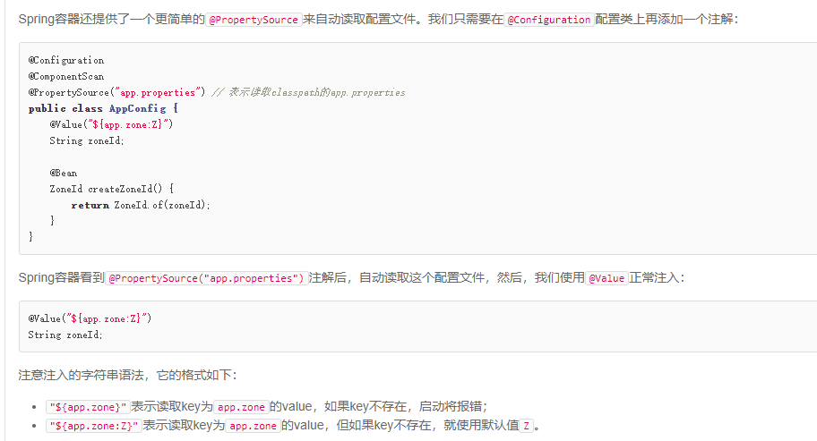

### spring

#### @component和@bean的区别
  - @component 相当于 通过类路径扫描来自动侦测以及自动装配到Spring容器中，相当于配置文件中的<bean id="" class=""/>
  - @bean加@Configuration
  ```$xslt
  @Component注解是在Spring 2.5版本引入的，以便于可以[通过路径扫描的方式来替换配置文件]。
  @Bean是在Spring3.0版本引入的，可以配合使用@Configuration注解来达到完全替换配置文件的目的。
  那么，我们是否可以仅使用二者其一？换句话说，二者有何区别呢？
  事实上，@Component和@Bean做两个完全不同的事情，不应该混为一谈。
  @Component（和@Service和@Repository）用于自动检测和使用类路径扫描自动配置bean。注释类和bean之间存在隐式的一对一映射（即每个类一个bean）。
  这种方法对需要进行逻辑处理的控制非常有限，因为它纯粹是声明性的。
  @Bean用于显式声明单个bean，而不是让Spring像上面那样自动执行它。它将bean的声明与类定义分离，并允许您精确地创建和配置bean。
  那我们在什么时候会使用@Bean？假设下，某天你想创建一个第三方的组件，但是你没有源代码，
  也就没办法使用@Component进行自动配置，这种时候使用@Bean就比较合适了
  ```
#### 读取配置文件的值


#### 使用条件装配
  @Bean
  @Profile("dev"):spring容器会根据dev环境配置bean
  
  @ConditionalOnClass(name = "javax.mail.Transport"):存在类是才会创建，否则不创建
  @ConditionalOnProperty(name="app.smtp", havingValue="true"):存在属性且值为true时才创建
  
spring的proxy代理对象是直接生成字节码对象(.class文件)，并没有源码编译成字节码的对象的过程
      spring通过CGLIB生成的代理类，不会初始化代理类自身继承的任何成员变量，包括final修饰的成员变量  
#### 声明式事务
platformTransectionManager: 事务管理器的顶级接口
配置DataSourceTransectionManager实现了platformtransectionManager;
@EnableTransactionManagement: 启用声明式事务：
对需要事务支持的方法，添加@transectional注解
事务只在当前线程传播，无法跨线程传播