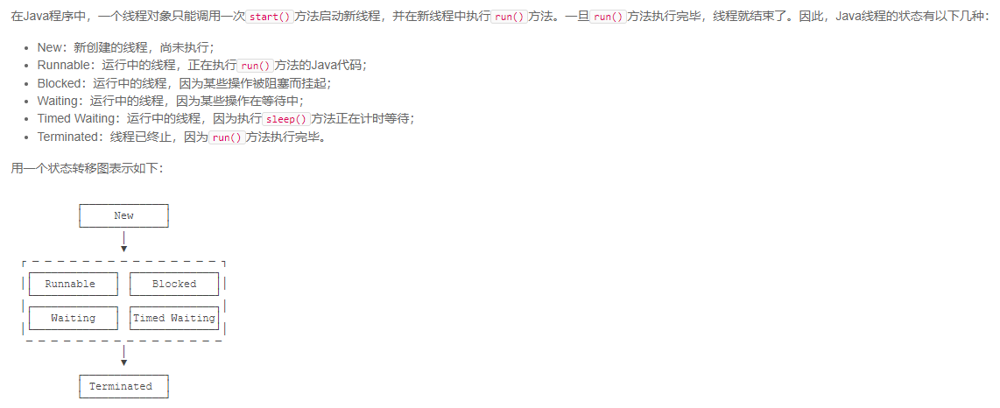

# Process
   ```$xslt
            Java用Thread对象表示一个线程，通过调用start()启动一个新线程；
                一个线程对象只能调用一次start()方法；
                线程的执行代码写在run()方法中；
                线程调度由操作系统决定，程序本身无法决定调度顺序；
                Thread.sleep()可以把当前线程暂停一段时间
                对目标线程调用interrupt()方法可以请求中断一个线程，目标线程通过检测isInterrupted()标志
                获取自身是否已中断。如果目标线程处于等待状态，该线程会捕获到InterruptedException；
  ```
### 线程的状态
 
```$xslt
        Java线程对象Thread的状态包括：New、Runnable、Blocked、Waiting、Timed Waiting和Terminated；
        通过对另一个线程对象调用join()方法可以等待其执行结束；
        可以指定等待时间，超过等待时间线程仍然没有结束就不再等待；
        对已经运行结束的线程调用join()方法会立刻返回。
 ```
  - volatile
    - volatile关键字的目的是告诉虚拟机：每次访问变量时，总是获取主内存的最新值；每次修改变量后，立刻回写到主内存。
# 守护线程
 - 创建守护线程： 
   - 方法和普通线程一样，只是在调用start()方法前，调用setDaemon(true)把该线程标记为守护线程
   - 守护线程不能持有任何需要关闭的资源，例如打开文件等，因为虚拟机退出时，守护线程没有任何机会来关闭文件，这会导致数据丢失


