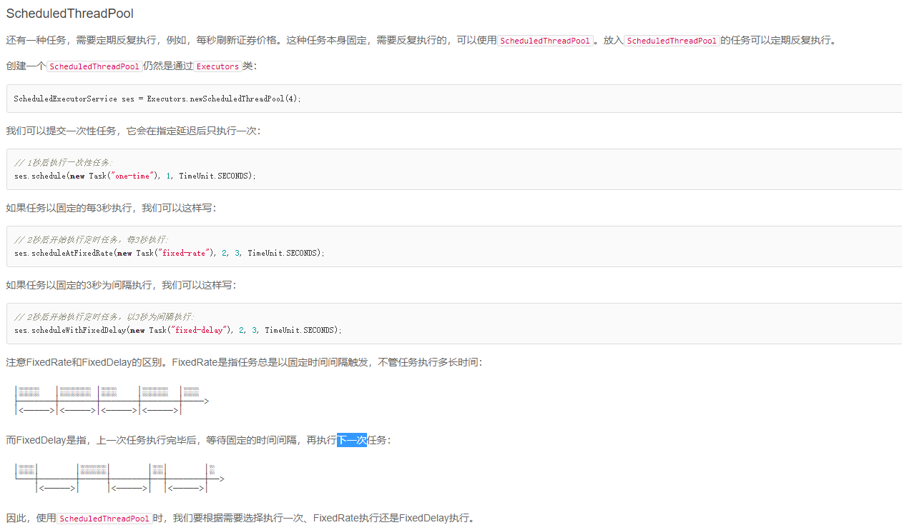

# Process
   ```$xslt
            Java用Thread对象表示一个线程，通过调用start()启动一个新线程；
                一个线程对象只能调用一次start()方法；
                线程的执行代码写在run()方法中；
                线程调度由操作系统决定，程序本身无法决定调度顺序；
                Thread.sleep()可以把当前线程暂停一段时间
                对目标线程调用interrupt()方法可以请求中断一个线程，目标线程通过检测isInterrupted()标志
                获取自身是否已中断。如果目标线程处于等待状态，该线程会捕获到InterruptedException；
  ```
### 线程的状态
 
```$xslt
        Java线程对象Thread的状态包括：New、Runnable、Blocked、Waiting、Timed Waiting和Terminated；
        通过对另一个线程对象调用join()方法可以等待其执行结束；
        可以指定等待时间，超过等待时间线程仍然没有结束就不再等待；
        对已经运行结束的线程调用join()方法会立刻返回。
 ```
  - volatile
    - volatile关键字的目的是告诉虚拟机：每次访问变量时，总是获取主内存的最新值；每次修改变量后，立刻回写到主内存。
# 守护线程
 - 创建守护线程： 
   - 方法和普通线程一样，只是在调用start()方法前，调用setDaemon(true)把该线程标记为守护线程
   - 守护线程不能持有任何需要关闭的资源，例如打开文件等，因为虚拟机退出时，守护线程没有任何机会来关闭文件，这会导致数据丢失
#### wait 和notity 
```$xslt
     wait和notify用于多线程协调运行：
        在synchronized内部可以调用wait()使线程进入等待状态；
        必须在已获得的锁对象上调用wait()方法；
        在synchronized内部可以调用notify()或notifyAll()唤醒其他等待线程；
        必须在已获得的锁对象上调用notify()或notifyAll()方法；
        已唤醒的线程还需要重新获得锁后才能继续执行。
```
#### ReentrantLock
  - 使用ReentrantLock比直接使用synchronized更安全，线程在tryLock()失败的时候不会导致死锁
#### condition
```$xslt
    Condition提供的await()、signal()、signalAll()原理和synchronized锁对象的wait()、notify()、notifyAll()是一致的，并且其行为也是一样的：
    await()会释放当前锁，进入等待状态；
    signal()会唤醒某个等待线程；
    signalAll()会唤醒所有等待线程；
    唤醒线程从await()返回后需要重新获得锁。
```
#### ReadWriteLock
```$xslt
    使用ReadWriteLock可以提高读取效率：
         ReadWriteLock只允许一个线程写入；
         ReadWriteLock允许多个线程在没有写入时同时读取；
         ReadWriteLock适合读多写少的场景。
```     
#### stampedLock
```$xslt
    深入分析ReadWriteLock，会发现它有个潜在的问题：如果有线程正在读，写线程需要等待读线程释放锁后才能获取写锁，即读的过程中不允许写，
    这是一种悲观的读锁。
    要进一步提升并发执行效率，Java 8引入了新的读写锁：StampedLock。
    StampedLock和ReadWriteLock相比，改进之处在于：读的过程中也允许获取写锁后写入！这样一来，我们读的数据就可能不一致，所以，
    需要一点额外的代码来判断读的过程中是否有写入，这种读锁是一种乐观锁。
    乐观锁的意思就是乐观地估计读的过程中大概率不会有写入，因此被称为乐观锁。反过来，悲观锁则是读的过程中拒绝有写入，也就是写入必须等待。
    显然乐观锁的并发效率更高，但一旦有小概率的写入导致读取的数据不一致，需要能检测出来，再读一遍就行。
    
    StampedLock提供了乐观读锁，可取代ReadWriteLock以进一步提升并发性能；
    StampedLock是不可重入锁。
```
#### threadpool
```$xslt
    public ThreadPoolExecutor(int corePoolSize, 核心线程数
                                  int maximumPoolSize, 最大线程数
                                  long keepAliveTime,  大于核心线程数的空闲线程存活时间
                                  TimeUnit unit,   存活时间单位
                                  BlockingQueue<Runnable> workQueue,  任务队列，被提交未被执行的任务
                                  ThreadFactory threadFactory,   线程工厂
                                  RejectedExecutionHandler handler) 拒绝策略
```
 
#### future
```$xslt
    一个Future<V>接口表示一个未来可能会返回的结果，它定义的方法有;
    get()：获取结果（可能会等待）
    get(long timeout, TimeUnit unit)：获取结果，但只等待指定的时间；
    cancel(boolean mayInterruptIfRunning)：取消当前任务；
    isDone()：判断任务是否已完成。
```
#### CompletableFuture 


